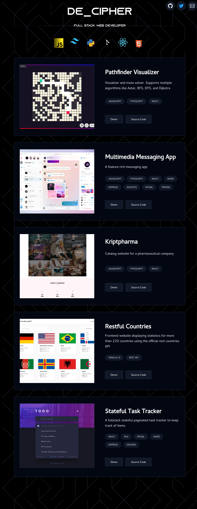

This is my a portfolio website.
I like simple and to-the-point websites so this portfolio follows the [K.I.S.S principle](https://en.wikipedia.org/wiki/KISS_principle).

### Preview

Click to open website preview

 

### Built With

-   React
-   Typescript
-   Tailwind v3

### Credits

-   [HyperUI](https://www.hyperui.dev/) for component insipiration
-   [CSS doodle](https://css-doodle.com/svg/?code=svg+%7B%0A++viewBox%3A+0+0+16+16+padding+.2%3B%0A++stroke%3A+%23aeacfb%3B%0A++stroke-width%3A+.005%3B%0A++stroke-linecap%3A+round%3B%0A++style+background%3A+black%3B%0A++%0A++line*16x16+%7B%0A++++draw%3A+%40r%281s%29%3B%0A++++x1%2C+y1%2C+x2%2C+y2%3A+%40p%28%0A++++++%40nx%28-1%29+%40ny%28-1%29+%40nx+%40ny%2C%0A++++++%40nx+%40ny%28-1%29+%40nx%28-1%29+%40ny%2C%0A++++++%40nx+%40ny%28-1%29+%40nx+%40ny%0A++++%29%3B%0A++%7D%0A%7D) for background svg
